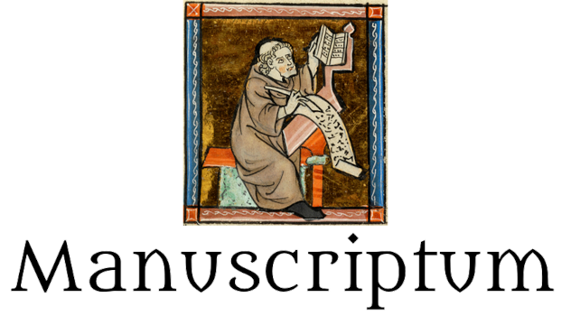

# Manuscriptum Obsidian Plugin

Manuscriptum is an [Obsidian.md](https://obsidian.md/) plugin for short story writers. It lets you export your stories as Microsoft Word `.docx` files that follow the [Shunn modern manuscript format](https://www.shunn.net/format/story/).

Features:

- Write your stories in a single note or a collection of notes.
- Save your stories as a Shunn manuscript document, ready for submission.
- Automatically create anonymous manuscripts.

## Using Manuscriptum

Each of your stories must be in its own folder. The story's title is the name of the folder. You can write your stories either in a single note or in a collection of notes. Multiple notes will be treated as individual scenes and combined with a scene break (`#`) between each one. To add scene breaks to an individual note, use the Markdown format for horizontal lines (`---`).

You can turn your story into a `.docx` file in two ways:

- Right click any note in your story folder or the story folder itself and select one of the "Save as manuscript..." Manuscripum commands from the context menu.
- Inside a note that contains any part of your story, open the command palette and select one of the Manuscriptum commands.

By default the story is put into a `.docx` file whose name matches the story's title, with spaces replaced by dashes.

## Settings

Shunn format requires information about the author, such as your author name and contact information, which you can define in the plugin's settings. You can override these settings on a per-story basis by adding the following [properties](https://help.obsidian.md/properties) to any note in a story folder:

- `title`: The story's title.
- `filename`: The filename to save the story to.
- `outdir`: The directory to save the story to.
- `author`: The author's name.
- `surname`: The author's surname.
- `contact`: The author's contact information.